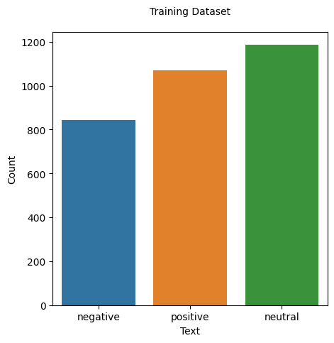

# Model Card 

- **Model Details.**
  - Team member: Martina Grazia Asselti, Daniela Grassi, Teresa Claudia Pennacchio, Federico Puleo. 
  - Date: 11/01/2024
  - Model Version: 1.0
  - Model Type: Classification model 
  - Algorithms: Random Forest, Linear Regression, Gradient Boosting
  - Features: Text related features:
    - The frequency of each punctuation mark
    - The total amount of words and characters 
    - The total amount of uppercase characters 
    - The total number of emoticons
  

- **Intended Use.**
Classify comments from StackOverflow in terms of sentiment (positive, negative, neutral). 
The classifier could be use to prevent the introduction of negative or toxic comments in this kind of platform. 

- **Factors.**
  Since the classification model is based on the StackOverflow posts, factors that can be considered are related to software developers.
-  **Metrics**
   -  Precision    
   -  Recall  
   -  F1-score
  
  -  **Evaluation Data**
  -  Initially the datasets contains the Stackoverflow comments. The overall dataset contains 3097 comments labelled with positive negative and neutral sentiment.  
The distribution of the labes are the following:

 
- The preprocessing consists of the removing of the user and link, substituting the actual user or link with "@user" or "\<link>"
- Moreover, removing of stop words and lemmatization are used. 
  -  **Training Data**
  -  **Quantitative Analysis**
  -  **Ethical Considerations**
  - **Caveats and Recommendations**
